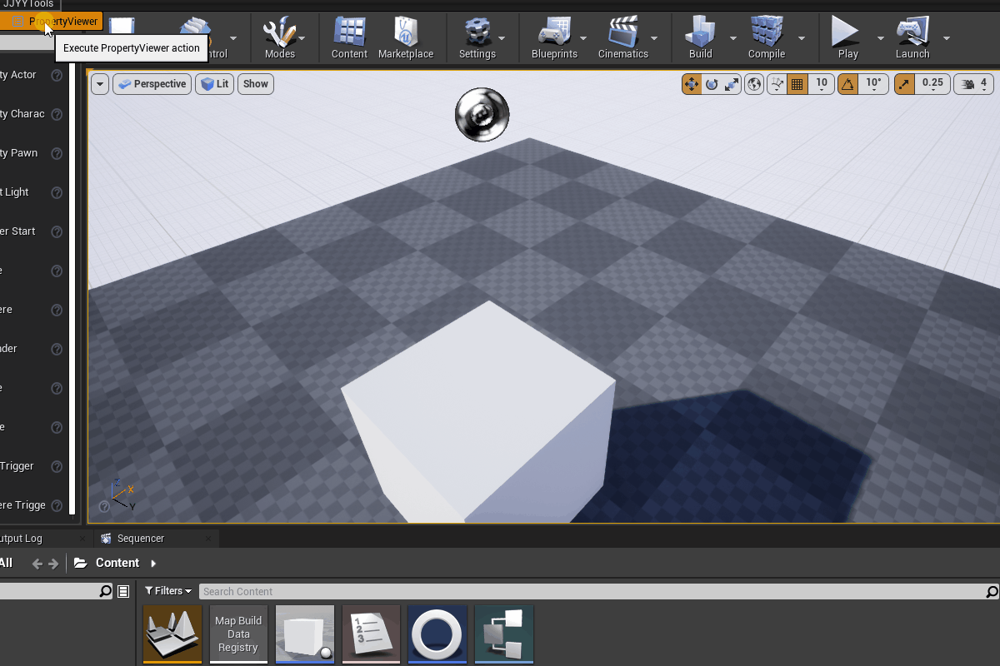
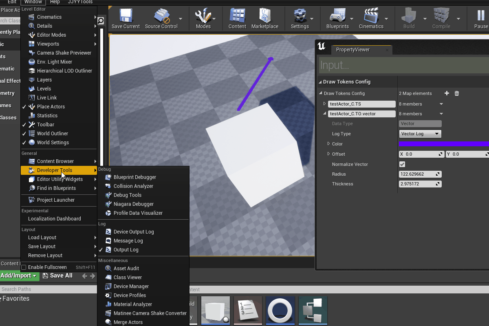

# JJYYPropertyViewer

[](https://github.com/RichardLitt/standard-readme)

这是一个用于查看游戏中对象的属性的工具，类似编辑器下的 details面板，不同的是它通过文本筛选的方式 在3D空间中显示想要的属性。
目前已经实现的功能有：
- 反射对象属性输出
- 针对向量类型用箭头输出
- 支持 Visual Log 搭配使用


## 内容列表

- [安装](#安装)
- [使用说明](#使用说明)
- [维护者](#维护者)
- [使用许可](#使用许可)

## 安装

直接下载Zip文件，或者使用git命令：

```
git clone https://github.com/JJYYs/JJYYPropertyViewer.git
```

## 使用说明
### 基本功能演示：

- 输入过程中 Tab 键可以辅助补全
- 输入过程中 Enter 键可以确认添加到列表


### visual log 功能演示：


## 维护者

[@JJYYs](https://github.com/JJYYs)

## 使用许可

[MIT](https://github.com/RichardLitt/standard-readme/blob/master/LICENSE) © JJYY